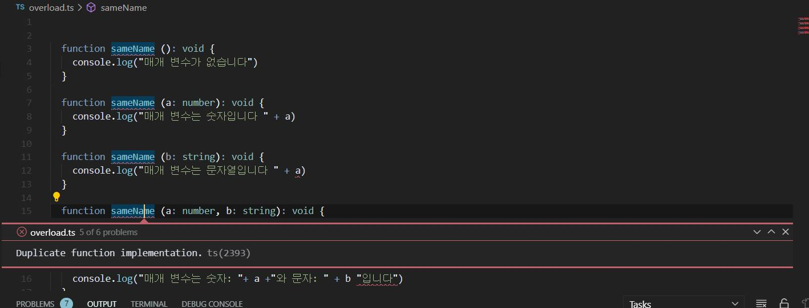
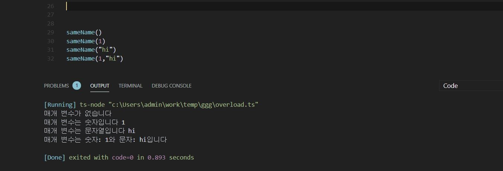
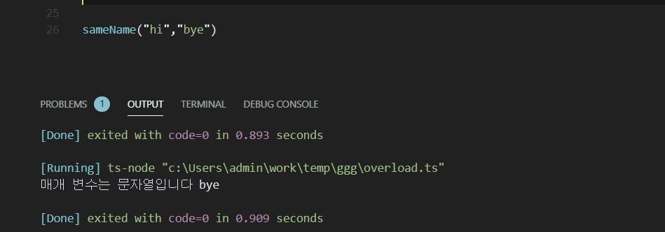
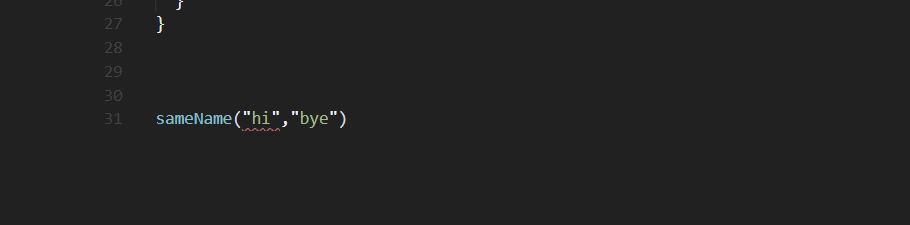

Overload는 동일한 이름을 가진 메소드에서 매개변수의 유형과 개수에 따라 메소드 구현부를 달리할 수 있는 기술을 의미합니다.

자바에서는 다음과 같이 표현합니다.

```java

public class Overload {

	void sameName () {
		console.log("매개 변수가 없습니다")
	}

	void sameName (int a) {
		console.log("매개 변수는 숫자입니다 " + a)
	}

	void sameName (String a) {
		console.log("매개 변수는 문자열입니다 " + a)
	}

	void sameName (int a, String b) {
		console.log("매개 변수는 숫자: "+ a +"와 문자: " + b + "입니다")
	}

}

```

위 코드를 보면 sameName이라는 메소드가 여러개가 있다는 것을 알 수 있습니다. 이 메소드에 어떤 매개변수를 넣느냐에 따라 console.log에 출력되는 문구는 다를 것입니다.

이와 같은 overload를 타입 스크립트(type script)에서도 구현할 수 있을까요?



보시다시피 동일한 이름을 가진 메소드들은 구현부를 여러개 가질 수 없습니다. 따라서 타입 스크립트에서는 overload를 다음과 같이 구현합니다.

```ts
function sameName (a?:number | string, b?:string): void {
	let isNoVariant: boolean
	let numVariant: number
	let stringVariant: string

	if (a=== undefined) isNoVariant = true
	if (typeof a === "number") numVariant = a
	if (typeof a === "string") stringVariant = a
	if (b !== undefined) stringVariant = b

	if(isNoVariant){
		console.log("매개 변수가 없습니다")
	} else if(numVariant && !(stringVariant)) {
		console.log("매개 변수는 숫자입니다 " + numVariant)
	} else if(stringVariant && !(numVariant)) {
		console.log("매개 변수는 문자열입니다 " + stringVariant)
	} else {
		console.log("매개 변수는 숫자: "+ numVariant +"와 문자: " + stringVariant + "입니다")
	}
}	
```


원하는 값이 제대로 출력되는지 확인해보겠습니다.



제대로 나오네요. (휴;;) 그런데 눈치채신 분들도 계시겠지만 위 코드에는 문제점이 있습니다.

우리는 sameName의 매개변수가
- 없거나 
- 숫자만 있거나
- 문자만 있거나
- 숫자와 문자 두 개 있거나

에 대해서만 overload를 하고 싶습니다.

이 외의 인풋값에 대해서는 에러가 떠야 하죠. 하지만 아래와 같이 원하지 않은 결과가 출력 됩니다.



sameName 메소드에 문자 타입 변수가 동시에 2개 들어가는 것은 의도하지 않았는데 말이죠.

이것은 sameName 코드 구현부에서 string 변수 2개가 들어올 경우에 대해서 처리하지 않았기 때문입니다. 그러면 이를 어떻게 해결 할까요?

물론 string 변수 2개가 들어올 때에 대한 케이스를 if 문으로 구현하면 되겠죠. 하지만 매번 overload를 구현할 때 마다 의도하지 않은 매개변수 조합에 대해 예외 처리를 구현하는 것은 힘든 일입니다. 아무래도 실수할 가능성이 크겠죠. 따라서 다음과 같이 매개변수로 올 수 있는 타입이 무엇이 있는지를 메소드 구현 전에 선언합니다.


```ts

function sameName()
function sameName(a: number)
function sameName(a: string)
function sameName(a: number, b:string)


function sameName (a?:number | string, b?:string): void {
	let isNoVariant: boolean
	let numVariant: number
	let stringVariant: string

   (...중략)
```

이렇게 하면 코드 구현부에 매개변수로 올 수 있는 모든 조합에 대해 코드를 구현하지 않아도 의도대로 overload를 구현할 수 있습니다.

