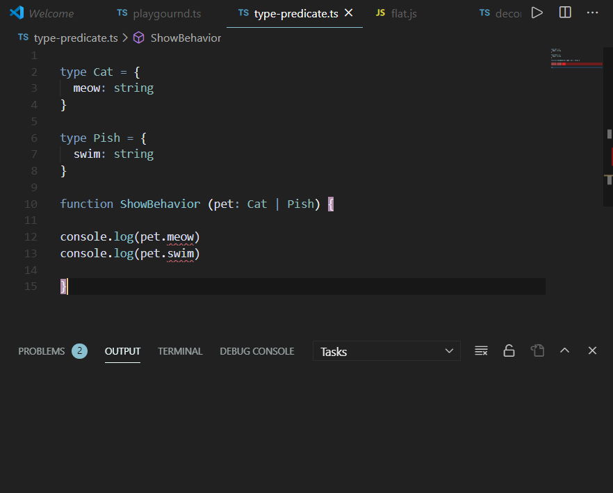
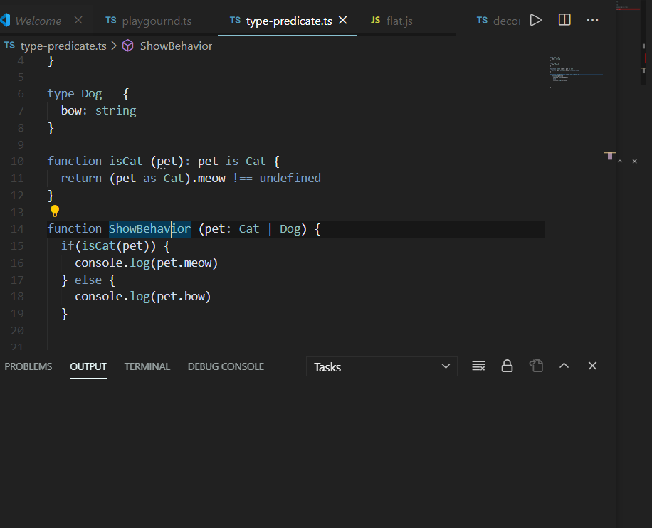
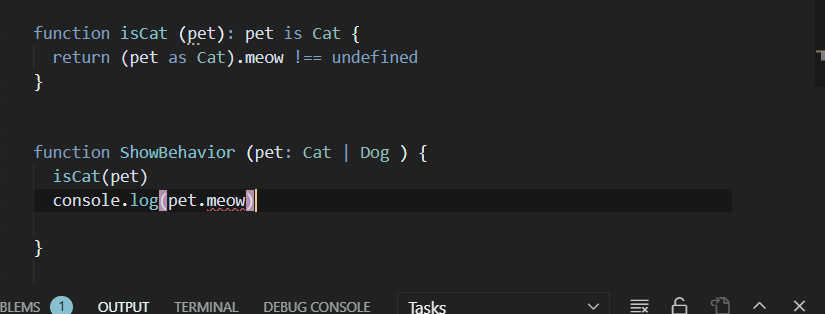
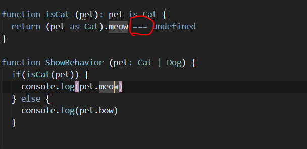
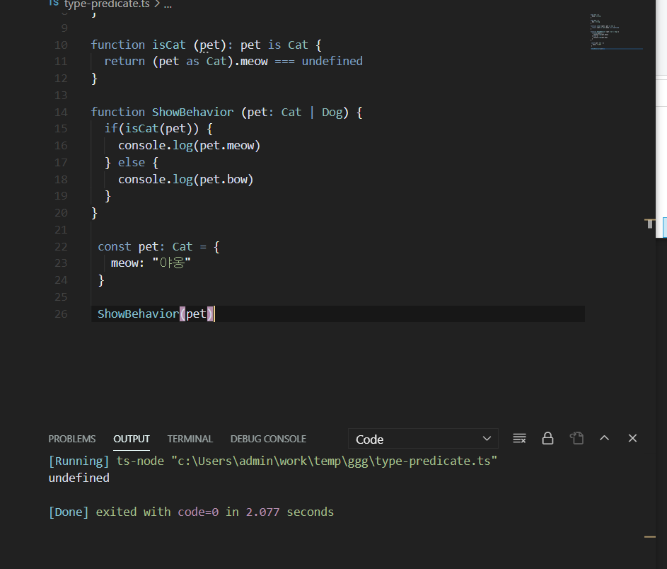
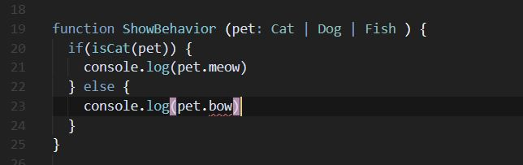

오늘은 타입 술부(type predicates)란 무엇인가에 대해 알아보도록 하겠습니다. 

먼저 타입을 단언하지 않고 객체의 속성을 호출하게 되면 아래와 같이 빨간줄이 뜹니다.




위 함수는 변수 타입이 Cat, Pish 두 가지가 올 수 있는데 변수 타입이 어떤게 올지 모르는 상태에서 특정 타입에만 있는 Property를 호출하게 되니 컴파일 전에 에러가 뜨는 거지요.

이를 해결하기 위해 타입을 컴파일러에게 알려주는 코드를 작성해보겠습니다.



위 사진에서 isCat이라는 함수의 리턴 타입을 "pet is Cat" 으로 기술하였는데 이것이 바로 타입 술부(type predicate)의 표현방법입니다.
## EXPRESSION
	Argument is Type


타입 술부가 명시된 함수는 리턴 타입이 꼭 boolean이어야 합니다. (string, number 등 불가)	
이렇게 타입 술부가 반환타입으로 명시된 함수를 타입 가드(Type Guard)라고 합니다. 타입 가드는 특정 범위(Scope)에서 변수의 타입을 컴파일러에게 알려주는 역할을 합니다.

```ts
function ShowBehavior (pet: Cat | Dog ) {
	if((pet as Cat).meow !== undefined) {
		console.log((pet as Cat).meow) //  
	} else {
		console.log((pet as Dog).bow) // 
	}
}
```

위 코드처럼 Argument as Type 이라고 단언하는 코드를 if 문 안에다가 매번 작성해야할 필요가 없는 것이지요.

위에서 타입 가드는 "특정 범위"에서 변수의 타입을 컴파일러에게 알려준다고 했는데요. 쉽게 말해서 if 문 안에 들어있는 변수에 대해서만 적용된다고 생각하면 될 것 같습니다.


즉 다음과 같은 코드에서는 범위가 주어지지 않아 에러가 뜹니다.



한 가지 재밌는 사실은 타입 가드에 의해 변수의 타입을 컴파일러에게 알려줄 때, 타입 가드가 실제로 어떤 값을 return하는지와는 관련이 없다는 것입니다.

즉 다음과 같은 코드에도 에러는 발생하지 않습니다.



물론 위 함수를 실행하면 잘못된 결과가 나오겠지요.



현재 function ShowBehavior에서 변수 타입은 Cat | Dog 두 가지 뿐입니다.    
따라서 Cat이 아니면 무조건 Dog이기 때문에 else 안에 pet.bow를 쓸 수 있지요. 만약 함수의 변수 타입이 3가지라면 당연히 else 안의 pet이 어떤 타입일지 컴파일러는 알 수 없을 것입니다.



